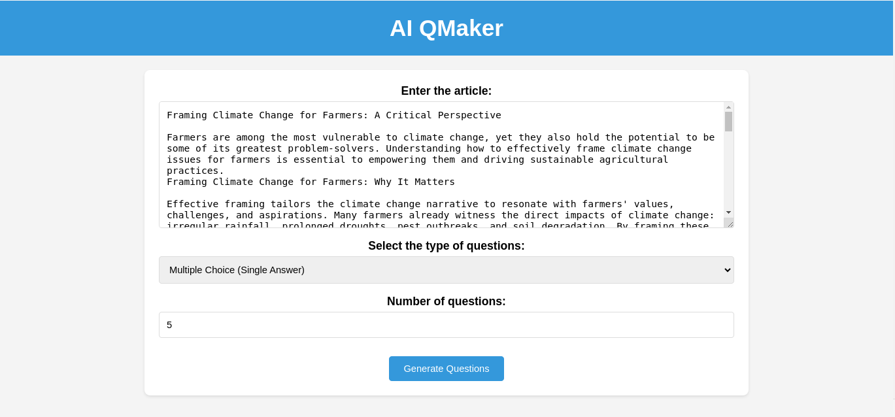
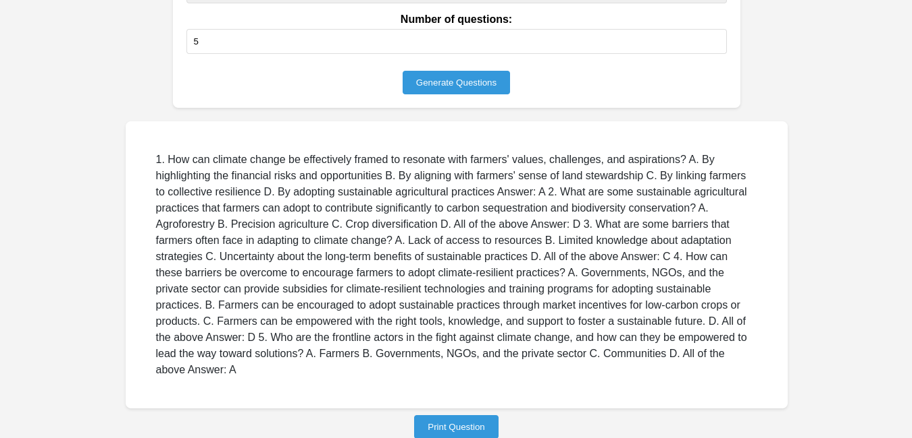
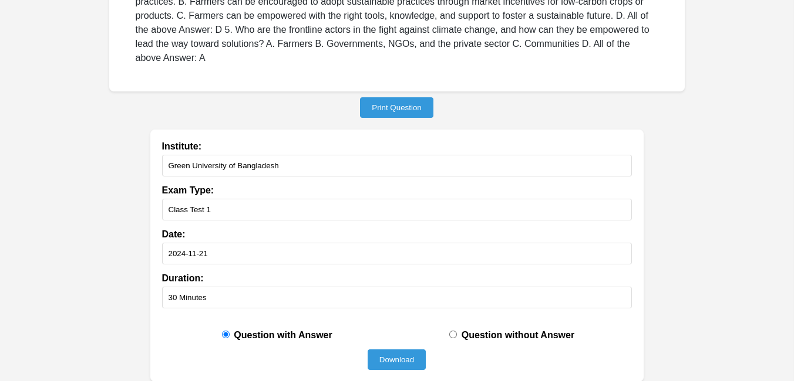

# AI QMaker: Revolutionizing Assessment Generation with AI

AI QMaker is a web application designed to assist educators in creating question papers efficiently and effectively. Powered by IBM Watsonx's powerful language models, it automatically generates a variety of question types based on provided text input.

**Features:**

* **Automated Question Generation:** Simply input your text, select the question type and number, and let AI QMaker do the rest.
* **Multiple Question Types:** Supports multiple-choice, true/false, essay questions, and more. The app provides a dropdown menu to select the desired question type.
* **Customizable Output:** Control the number of questions and download with or without answers.
* **Easy Download:** Get your generated questions in a convenient text file format.
* **Powered by IBM Watsonx:** Leverages the advanced natural language processing capabilities of IBM's AI platform.

**Benefits for Educators:**

* **Saves Time:** Reduce the time spent manually creating assessments.
* **Enhances Quality:** Ensures consistent question quality and relevance.
* **Increases Efficiency:** Streamlines the assessment creation process.
* **Supports Diverse Needs:** Adapts to various question formats and learning objectives.

**Screenshots:**

  
*This screenshot shows the input form where educators paste their text, select question type and number.*

  
*This screenshot shows the generated questions displayed on the page.*

  
*This screenshot shows the download options allowing educators to customize their output.*

**Instructions for Using AI QMaker:**

1. **Access the Application:** Open the AI QMaker web application in your browser.
2. **Article Input:** Paste the text you want to generate questions from into the "Enter the article" text area. This could be a lesson summary, an article, or any relevant textual content.
3. **Question Type Selection:** Choose the desired format of questions (e.g., Multiple Choice, True/False, Essay) from the dropdown menu.
4. **Number of Questions:** Specify the number of questions you want AI QMaker to generate using the number input field.
5. **Generate Questions:** Click the "Generate Questions" button.
6. **Review Generated Questions:** The generated questions will appear below the form. Carefully review them for accuracy and relevance.
7. **Download Options (Optional):**  If you're ready to download the questions:
    * Click the "Print Question" button. *(This will reveal the download options form)*
    * Fill in the institute, exam type, date, and duration.
    * Choose whether to include answers by selecting the appropriate radio button.
8. **Download:** Click the "Download" button to download the questions as a `.txt` file.

**Getting Started (Development Setup):**

1. **Clone the repository:**  `git clone https://github.com/mmfarabi/AI-QMaker.git`
2. **Install dependencies:**  `pip install -r requirements.txt`
3. **Set up your IBM Watsonx credentials:**
    * Create an account on IBM Cloud and provision a Watsonx instance. Get your API key and project ID.
    * In the `app.py` file:
        * Replace `"YOUR_API_KEY"` with your actual API key.
        * Replace `"YOUR_PROJECT_ID"` with your actual project ID.
4. **Run the application:** `python app.py`
5. **Access the app in your browser:** `http://127.0.0.1:5000/`

**Technologies Used:**

* Python
* Flask
* IBM Watsonx
* HTML/CSS/JavaScript

**Future Enhancements (Roadmap):**

* Integration with Learning Management Systems (LMS).
* Advanced analytics to track student performance.
* Support for more languages.
* Personalized learning recommendations based on assessment results. 

**Contributing:**

Contributions are welcome!  Please open an issue or submit a pull request.

**License:**

MIT License
